# Java设计模式

## 创建型模式 (Creational Patterns)

### 1. 单例模式 (Singleton Pattern)

**原理**: 确保一个类只有一个实例，并提供全局访问点。

**使用场景**: 配置管理器、数据库连接池、日志记录器、线程池。

**类图**:
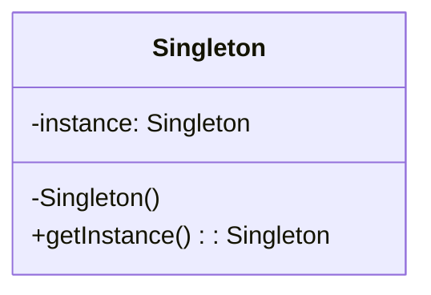
```mermaid
classDiagram
    class Singleton {
        -instance: Singleton
        -Singleton()
        +getInstance(): Singleton
    }
```

```java
// 饿汉式（线程安全，推荐）
public class ConfigManager {
    private static final ConfigManager INSTANCE = new ConfigManager();
    private String config;
    
    private ConfigManager() {}
    
    public static ConfigManager getInstance() {
        return INSTANCE;
    }
    
    public String getConfig() {
        return config;
    }
    
    public void setConfig(String config) {
        this.config = config;
    }
}

// 枚举实现（推荐，线程安全）
public enum DatabaseConnection {
    INSTANCE;
    
    private String connectionString;
    
    public void setConnectionString(String connectionString) {
        this.connectionString = connectionString;
    }
    
    public String getConnectionString() {
        return connectionString;
    }
}

// 懒汉式 + 双重检查锁定（线程安全）
public class Logger {
    private static volatile Logger instance;
    
    private Logger() {}
    
    public static Logger getInstance() {
        if (instance == null) {
            synchronized (Logger.class) {
                if (instance == null) {
                    instance = new Logger();
                }
            }
        }
        return instance;
    }
}
```

### 2. 工厂方法模式 (Factory Method Pattern)

**原理**: 创建对象时不指定具体类，而是通过工厂方法创建。

**使用场景**: 支付系统、数据库驱动、UI组件创建。

**类图**:
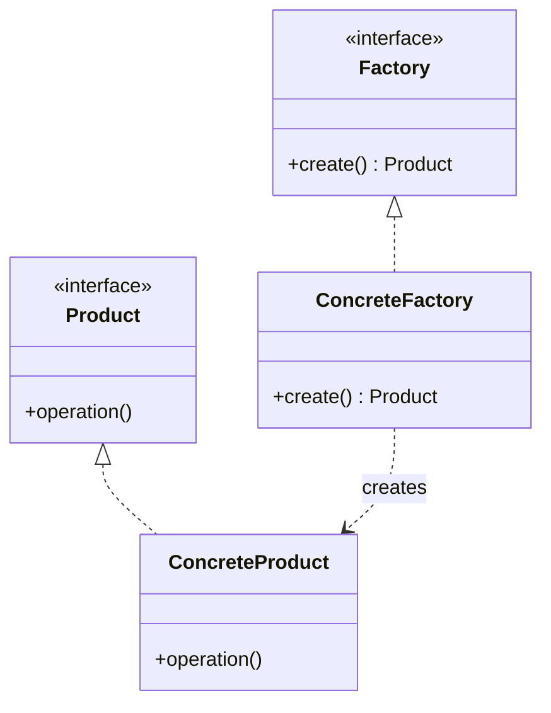
```mermaid
classDiagram
    class Product {
        <<interface>>
        +operation()
    }
    class Factory {
        <<interface>>
        +create() Product
    }
    class ConcreteProduct {
        +operation()
    }
    class ConcreteFactory {
        +create() Product
    }
    
    Product <|.. ConcreteProduct
    Factory <|.. ConcreteFactory
    ConcreteFactory ..> ConcreteProduct : creates
```

```java
// 简单工厂
public class PaymentFactory {
    public static Payment createPayment(PaymentType type) {
        return switch (type) {
            case CREDIT_CARD -> new CreditCardPayment();
            case PAYPAL -> new PayPalPayment();
            case ALIPAY -> new AlipayPayment();
        };
    }
}

// 抽象工厂
public interface PaymentProcessorFactory {
    PaymentProcessor createProcessor();
    PaymentValidator createValidator();
}

public class CreditCardFactory implements PaymentProcessorFactory {
    @Override
    public PaymentProcessor createProcessor() {
        return new CreditCardProcessor();
    }
    
    @Override
    public PaymentValidator createValidator() {
        return new CreditCardValidator();
    }
}
```

### 3. 抽象工厂模式 (Abstract Factory Pattern)

**原理**: 提供一个创建一系列相关或相互依赖对象的接口，而无需指定它们的具体类。

**使用场景**: 跨平台UI组件、数据库访问层、主题系统。

**类图**:
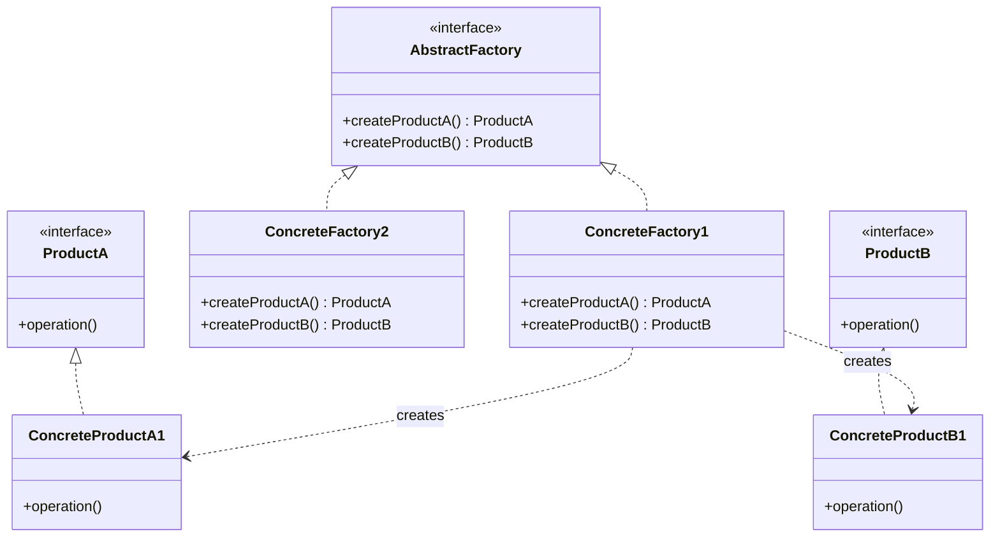
```mermaid
classDiagram
    class AbstractFactory {
        <<interface>>
        +createProductA() ProductA
        +createProductB() ProductB
    }
    class ConcreteFactory1 {
        +createProductA() ProductA
        +createProductB() ProductB
    }
    class ConcreteFactory2 {
        +createProductA() ProductA
        +createProductB() ProductB
    }
    class ProductA {
        <<interface>>
        +operation()
    }
    class ProductB {
        <<interface>>
        +operation()
    }
    class ConcreteProductA1 {
        +operation()
    }
    class ConcreteProductB1 {
        +operation()
    }
    
    AbstractFactory <|.. ConcreteFactory1
    AbstractFactory <|.. ConcreteFactory2
    ProductA <|.. ConcreteProductA1
    ProductB <|.. ConcreteProductB1
    ConcreteFactory1 ..> ConcreteProductA1 : creates
    ConcreteFactory1 ..> ConcreteProductB1 : creates
```

```java
// 抽象产品
public interface Button {
    void render();
}

public interface Checkbox {
    void render();
}

// 具体产品
public class WindowsButton implements Button {
    @Override
    public void render() {
        System.out.println("Windows Button");
    }
}

public class MacButton implements Button {
    @Override
    public void render() {
        System.out.println("Mac Button");
    }
}

public class WindowsCheckbox implements Checkbox {
    @Override
    public void render() {
        System.out.println("Windows Checkbox");
    }
}

public class MacCheckbox implements Checkbox {
    @Override
    public void render() {
        System.out.println("Mac Checkbox");
    }
}

// 抽象工厂
public interface GUIFactory {
    Button createButton();
    Checkbox createCheckbox();
}

// 具体工厂
public class WindowsFactory implements GUIFactory {
    @Override
    public Button createButton() {
        return new WindowsButton();
    }
    
    @Override
    public Checkbox createCheckbox() {
        return new WindowsCheckbox();
    }
}

public class MacFactory implements GUIFactory {
    @Override
    public Button createButton() {
        return new MacButton();
    }
    
    @Override
    public Checkbox createCheckbox() {
        return new MacCheckbox();
    }
}

// 使用示例
public class Application {
    private final Button button;
    private final Checkbox checkbox;
    
    public Application(GUIFactory factory) {
        this.button = factory.createButton();
        this.checkbox = factory.createCheckbox();
    }
    
    public void render() {
        button.render();
        checkbox.render();
    }
}
```

### 4. 建造者模式 (Builder Pattern)

**原理**: 分步骤构建复杂对象，使用相同的构建过程创建不同的表示。

**使用场景**: 复杂对象构建、配置对象、SQL查询构建。

**类图**:
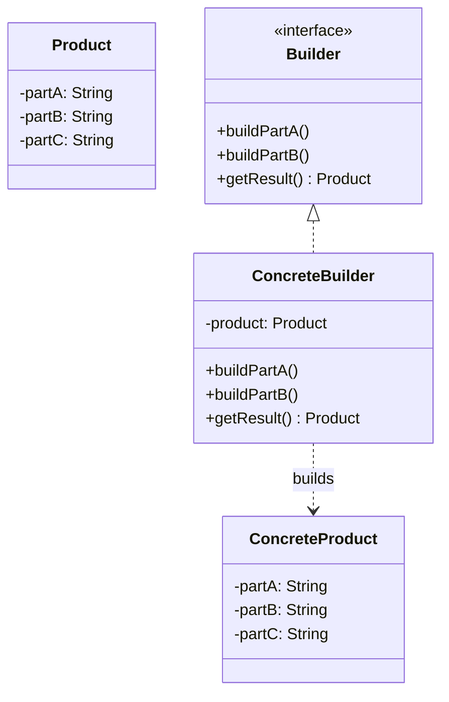
```mermaid
classDiagram
    class Product {
        -partA: String
        -partB: String
        -partC: String
    }
    class Builder {
        <<interface>>
        +buildPartA()
        +buildPartB()
        +getResult() Product
    }
    class ConcreteProduct {
        -partA: String
        -partB: String
        -partC: String
    }
    class ConcreteBuilder {
        -product: Product
        +buildPartA()
        +buildPartB()
        +getResult() Product
    }
    
    Builder <|.. ConcreteBuilder
    ConcreteBuilder ..> ConcreteProduct : builds
```

```java
public class Computer {
    private final String cpu;
    private final String memory;
    private final String storage;
    private final String graphics;
    
    private Computer(Builder builder) {
        this.cpu = builder.cpu;
        this.memory = builder.memory;
        this.storage = builder.storage;
        this.graphics = builder.graphics;
    }
    
    public static class Builder {
        private String cpu;
        private String memory;
        private String storage;
        private String graphics;
        
        public Builder cpu(String cpu) {
            this.cpu = cpu;
            return this;
        }
        
        public Builder memory(String memory) {
            this.memory = memory;
            return this;
        }
        
        public Builder storage(String storage) {
            this.storage = storage;
            return this;
        }
        
        public Builder graphics(String graphics) {
            this.graphics = graphics;
            return this;
        }
        
        public Computer build() {
            return new Computer(this);
        }
    }
}

// 使用示例
Computer computer = new Computer.Builder()
    .cpu("Intel i7")
    .memory("16GB")
    .storage("512GB SSD")
    .graphics("RTX 3080")
    .build();
```

### 4. 原型模式 (Prototype Pattern)

**原理**: 通过克隆现有实例来创建新对象，避免重复创建相似对象。

**使用场景**: 对象创建成本高、需要大量相似对象、配置对象复制。

**类图**:
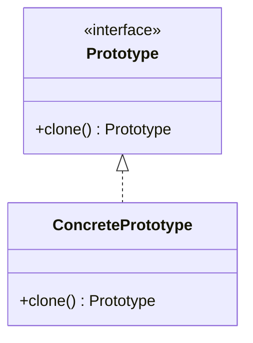
```mermaid
classDiagram
    class Prototype {
        <<interface>>
        +clone() Prototype
    }
    class ConcretePrototype {
        +clone() Prototype
    }
    
    Prototype <|.. ConcretePrototype
```

```java
public abstract class Shape implements Cloneable {
    protected String type;
    
    public abstract void draw();
    
    @Override
    public Object clone() {
        try {
            return super.clone();
        } catch (CloneNotSupportedException e) {
            throw new RuntimeException(e);
        }
    }
}

public class Circle extends Shape {
    public Circle() {
        type = "Circle";
    }
    
    @Override
    public void draw() {
        System.out.println("Drawing Circle");
    }
}

// 原型管理器
public class ShapeCache {
    private static final Map<String, Shape> shapeMap = new HashMap<>();
    
    static {
        shapeMap.put("circle", new Circle());
        shapeMap.put("rectangle", new Rectangle());
    }
    
    public static Shape getShape(String shapeId) {
        return (Shape) shapeMap.get(shapeId).clone();
    }
}
```

## 结构型模式 (Structural Patterns)

### 5. 适配器模式 (Adapter Pattern)

**原理**: 将不兼容的接口转换为客户端期望的接口。

**使用场景**: 第三方库集成、遗留系统改造、数据格式转换。

**类图**:
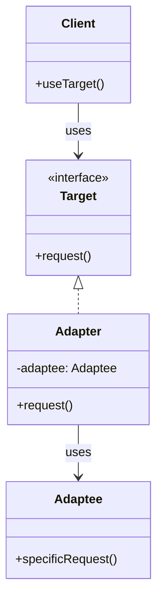
```mermaid
classDiagram
    class Target {
        <<interface>>
        +request()
    }
    class Adaptee {
        +specificRequest()
    }
    class Adapter {
        -adaptee: Adaptee
        +request()
    }
    class Client {
        +useTarget()
    }
    
    Target <|.. Adapter
    Adapter --> Adaptee : uses
    Client --> Target : uses
```

```java
// 目标接口
public interface MediaPlayer {
    void play(String audioType, String fileName);
}

// 被适配者
public class Mp4Player {
    public void playMp4(String fileName) {
        System.out.println("Playing mp4 file: " + fileName);
    }
}

// 适配器
public class MediaAdapter implements MediaPlayer {
    private final Mp4Player mp4Player;
    
    public MediaAdapter() {
        this.mp4Player = new Mp4Player();
    }
    
    @Override
    public void play(String audioType, String fileName) {
        if ("mp4".equalsIgnoreCase(audioType)) {
            mp4Player.playMp4(fileName);
        }
    }
}

// 客户端
public class AudioPlayer implements MediaPlayer {
    private final MediaAdapter mediaAdapter = new MediaAdapter();
    
    @Override
    public void play(String audioType, String fileName) {
        if ("mp3".equalsIgnoreCase(audioType)) {
            System.out.println("Playing mp3 file: " + fileName);
        } else {
            mediaAdapter.play(audioType, fileName);
        }
    }
}
```

### 6. 装饰器模式 (Decorator Pattern)

**原理**: 动态地给对象添加功能，比继承更灵活。

**使用场景**: 流处理、UI组件增强、权限控制、日志记录。

**类图**:
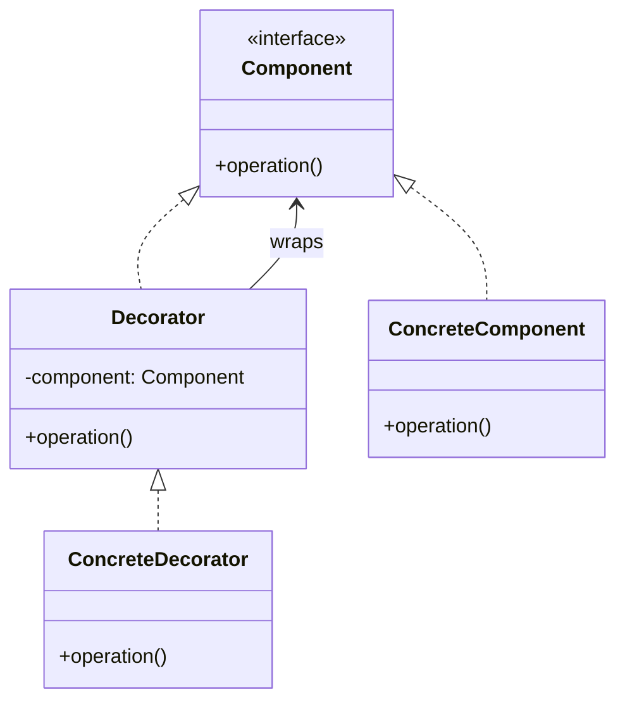
```mermaid
classDiagram
    class Component {
        <<interface>>
        +operation()
    }
    class Decorator {
        -component: Component
        +operation()
    }
    class ConcreteComponent {
        +operation()
    }
    class ConcreteDecorator {
        +operation()
    }
    
    Component <|.. ConcreteComponent
    Component <|.. Decorator
    Decorator <|.. ConcreteDecorator
    Decorator --> Component : wraps
```

```java
// 基础组件
public interface Coffee {
    String getDescription();
    double getCost();
}

public class SimpleCoffee implements Coffee {
    @Override
    public String getDescription() {
        return "Simple coffee";
    }
    
    @Override
    public double getCost() {
        return 2.0;
    }
}

// 装饰器基类
public abstract class CoffeeDecorator implements Coffee {
    protected final Coffee coffee;
    
    public CoffeeDecorator(Coffee coffee) {
        this.coffee = coffee;
    }
    
    @Override
    public String getDescription() {
        return coffee.getDescription();
    }
    
    @Override
    public double getCost() {
        return coffee.getCost();
    }
}

// 具体装饰器
public class MilkDecorator extends CoffeeDecorator {
    public MilkDecorator(Coffee coffee) {
        super(coffee);
    }
    
    @Override
    public String getDescription() {
        return coffee.getDescription() + ", milk";
    }
    
    @Override
    public double getCost() {
        return coffee.getCost() + 0.5;
    }
}

// 使用示例
Coffee coffee = new MilkDecorator(new SugarDecorator(new SimpleCoffee()));
```

### 7. 外观模式 (Facade Pattern)

**原理**: 为复杂子系统提供统一接口，隐藏内部复杂性。

**使用场景**: 系统集成、API封装、复杂操作简化。

**类图**:
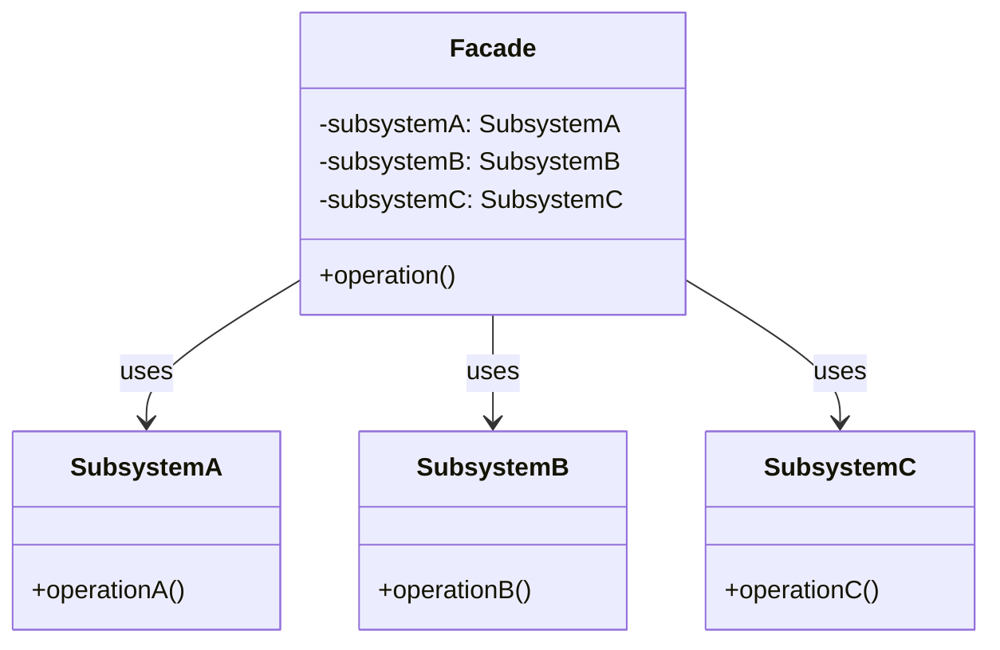
```mermaid
classDiagram
    class Facade {
        -subsystemA: SubsystemA
        -subsystemB: SubsystemB
        -subsystemC: SubsystemC
        +operation()
    }
    class SubsystemA {
        +operationA()
    }
    class SubsystemB {
        +operationB()
    }
    class SubsystemC {
        +operationC()
    }
    
    Facade --> SubsystemA : uses
    Facade --> SubsystemB : uses
    Facade --> SubsystemC : uses
```

```java
// 子系统组件
public class CPU {
    public void freeze() { System.out.println("CPU freeze"); }
    public void jump(long position) { System.out.println("CPU jump to " + position); }
    public void execute() { System.out.println("CPU execute"); }
}

public class Memory {
    public void load(long position, byte[] data) {
        System.out.println("Memory load at " + position);
    }
}

public class HardDrive {
    public byte[] read(long lba, int size) {
        System.out.println("HardDrive read " + size + " bytes from " + lba);
        return new byte[size];
    }
}

// 外观类
public class ComputerFacade {
    private final CPU processor;
    private final Memory ram;
    private final HardDrive hd;
    
    public ComputerFacade() {
        this.processor = new CPU();
        this.ram = new Memory();
        this.hd = new HardDrive();
    }
    
    public void start() {
        processor.freeze();
        ram.load(0, hd.read(0, 1024));
        processor.jump(0);
        processor.execute();
    }
}
```

### 8. 桥接模式 (Bridge Pattern)

**原理**: 将抽象部分与实现部分分离，使它们可以独立变化。

**使用场景**: 跨平台图形库、数据库驱动、设备控制。

**类图**:
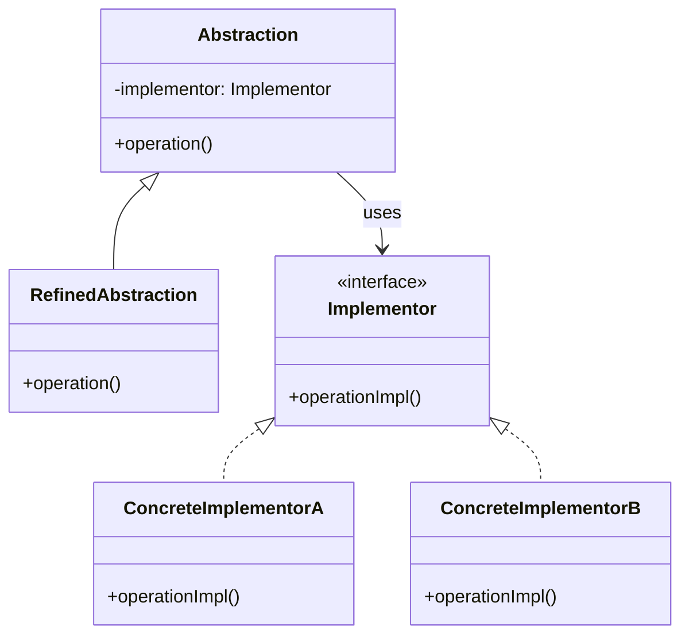
```mermaid
classDiagram
    class Abstraction {
        -implementor: Implementor
        +operation()
    }
    class RefinedAbstraction {
        +operation()
    }
    class Implementor {
        <<interface>>
        +operationImpl()
    }
    class ConcreteImplementorA {
        +operationImpl()
    }
    class ConcreteImplementorB {
        +operationImpl()
    }
    
    Abstraction <|-- RefinedAbstraction
    Implementor <|.. ConcreteImplementorA
    Implementor <|.. ConcreteImplementorB
    Abstraction --> Implementor : uses
```

```java
// 实现者接口
public interface DrawingAPI {
    void drawCircle(double x, double y, double radius);
}

// 具体实现者
public class DrawingAPI1 implements DrawingAPI {
    @Override
    public void drawCircle(double x, double y, double radius) {
        System.out.printf("API1.circle at %f:%f radius %f%n", x, y, radius);
    }
}

public class DrawingAPI2 implements DrawingAPI {
    @Override
    public void drawCircle(double x, double y, double radius) {
        System.out.printf("API2.circle at %f:%f radius %f%n", x, y, radius);
    }
}

// 抽象类
public abstract class Shape {
    protected DrawingAPI drawingAPI;
    
    protected Shape(DrawingAPI drawingAPI) {
        this.drawingAPI = drawingAPI;
    }
    
    public abstract void draw();
}

// 具体抽象类
public class CircleShape extends Shape {
    private double x, y, radius;
    
    public CircleShape(double x, double y, double radius, DrawingAPI drawingAPI) {
        super(drawingAPI);
        this.x = x;
        this.y = y;
        this.radius = radius;
    }
    
    @Override
    public void draw() {
        drawingAPI.drawCircle(x, y, radius);
    }
}

// 使用示例
Shape circle1 = new CircleShape(1, 2, 3, new DrawingAPI1());
Shape circle2 = new CircleShape(5, 7, 11, new DrawingAPI2());
circle1.draw();
circle2.draw();
```

### 9. 组合模式 (Composite Pattern)

**原理**: 将对象组合成树形结构以表示"部分-整体"的层次结构，使得用户对单个对象和组合对象的使用具有一致性。

**使用场景**: 文件系统、UI组件树、组织架构。

**类图**:
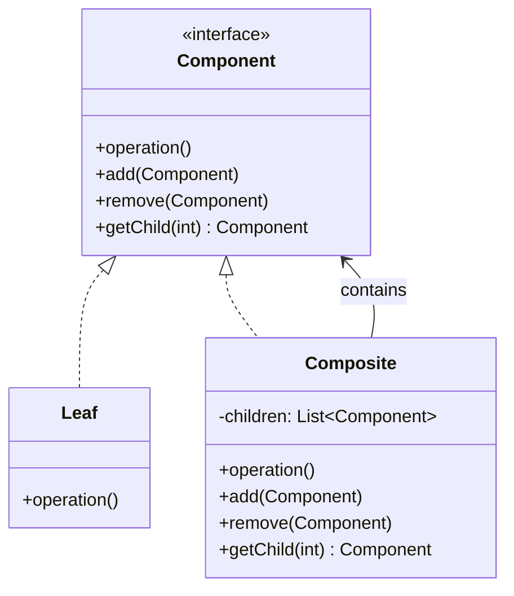
```mermaid
classDiagram
    class Component {
        <<interface>>
        +operation()
        +add(Component)
        +remove(Component)
        +getChild(int) Component
    }
    class Leaf {
        +operation()
    }
    class Composite {
        -children: List~Component~
        +operation()
        +add(Component)
        +remove(Component)
        +getChild(int) Component
    }
    
    Component <|.. Leaf
    Component <|.. Composite
    Composite --> Component : contains
```

```java
// 组件接口
public interface FileSystemComponent {
    void display(String indent);
    long getSize();
}

// 叶子节点
public class File implements FileSystemComponent {
    private final String name;
    private final long size;
    
    public File(String name, long size) {
        this.name = name;
        this.size = size;
    }
    
    @Override
    public void display(String indent) {
        System.out.println(indent + "File: " + name + " (" + size + " bytes)");
    }
    
    @Override
    public long getSize() {
        return size;
    }
}

// 组合节点
public class Directory implements FileSystemComponent {
    private final String name;
    private final List<FileSystemComponent> children = new ArrayList<>();
    
    public Directory(String name) {
        this.name = name;
    }
    
    public void add(FileSystemComponent component) {
        children.add(component);
    }
    
    public void remove(FileSystemComponent component) {
        children.remove(component);
    }
    
    @Override
    public void display(String indent) {
        System.out.println(indent + "Directory: " + name);
        children.forEach(child -> child.display(indent + "  "));
    }
    
    @Override
    public long getSize() {
        return children.stream().mapToLong(FileSystemComponent::getSize).sum();
    }
}

// 使用示例
Directory root = new Directory("root");
Directory documents = new Directory("documents");
File file1 = new File("readme.txt", 1024);
File file2 = new File("config.xml", 2048);

root.add(documents);
documents.add(file1);
documents.add(file2);

root.display("");
System.out.println("Total size: " + root.getSize() + " bytes");
```

### 10. 享元模式 (Flyweight Pattern)

**原理**: 运用共享技术有效地支持大量细粒度的对象。

**使用场景**: 文本编辑器、游戏中的粒子系统、数据库连接池。

**类图**:
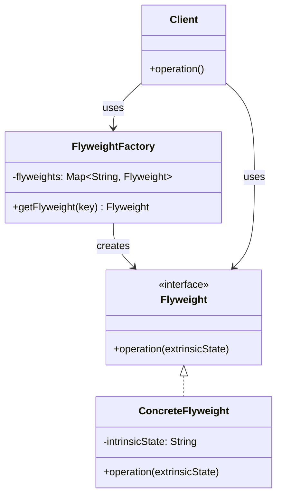
```mermaid
classDiagram
    class Flyweight {
        <<interface>>
        +operation(extrinsicState)
    }
    class ConcreteFlyweight {
        -intrinsicState: String
        +operation(extrinsicState)
    }
    class FlyweightFactory {
        -flyweights: Map~String, Flyweight~
        +getFlyweight(key) Flyweight
    }
    class Client {
        +operation()
    }
    
    Flyweight <|.. ConcreteFlyweight
    FlyweightFactory --> Flyweight : creates
    Client --> FlyweightFactory : uses
    Client --> Flyweight : uses
```

```java
// 享元接口
public interface Shape {
    void draw(int x, int y);
}

// 具体享元
public class Circle implements Shape {
    private final String color;
    
    public Circle(String color) {
        this.color = color;
    }
    
    @Override
    public void draw(int x, int y) {
        System.out.println("Drawing " + color + " circle at (" + x + ", " + y + ")");
    }
}

// 享元工厂
public class ShapeFactory {
    private static final Map<String, Shape> circleMap = new HashMap<>();
    
    public static Shape getCircle(String color) {
        return circleMap.computeIfAbsent(color, Circle::new);
    }
    
    public static int getTotalShapes() {
        return circleMap.size();
    }
}

// 使用示例
String[] colors = {"Red", "Green", "Blue", "White", "Black"};
Random random = new Random();

for (int i = 0; i < 20; i++) {
    String color = colors[random.nextInt(colors.length)];
    Shape circle = ShapeFactory.getCircle(color);
    circle.draw(random.nextInt(100), random.nextInt(100));
}

System.out.println("Total shapes created: " + ShapeFactory.getTotalShapes());
```

### 11. 代理模式 (Proxy Pattern)

**原理**: 为其他对象提供代理以控制对这个对象的访问。

**使用场景**: 远程代理、虚拟代理、安全代理、缓存代理。

**类图**:
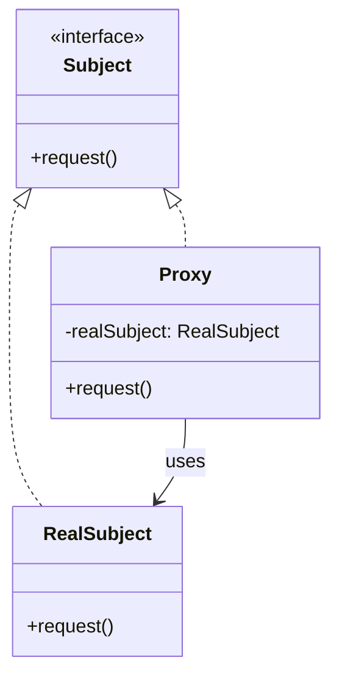
```mermaid
classDiagram
    class Subject {
        <<interface>>
        +request()
    }
    class Proxy {
        -realSubject: RealSubject
        +request()
    }
    class RealSubject {
        +request()
    }
    
    Subject <|.. Proxy
    Subject <|.. RealSubject
    Proxy --> RealSubject : uses
```

```java
// 主题接口
public interface Image {
    void display();
}

// 真实主题
public class RealImage implements Image {
    private final String filename;
    
    public RealImage(String filename) {
        this.filename = filename;
        loadFromDisk();
    }
    
    private void loadFromDisk() {
        System.out.println("Loading " + filename);
    }
    
    @Override
    public void display() {
        System.out.println("Displaying " + filename);
    }
}

// 代理类
public class ProxyImage implements Image {
    private RealImage realImage;
    private final String filename;
    
    public ProxyImage(String filename) {
        this.filename = filename;
    }
    
    @Override
    public void display() {
        if (realImage == null) {
            realImage = new RealImage(filename);
        }
        realImage.display();
    }
}
```

## 行为型模式 (Behavioral Patterns)

### 9. 观察者模式 (Observer Pattern)

**原理**: 定义对象间一对多依赖，当对象状态改变时，所有依赖者都会收到通知。

**使用场景**: 事件处理、MVC架构、发布-订阅系统。

**类图**:
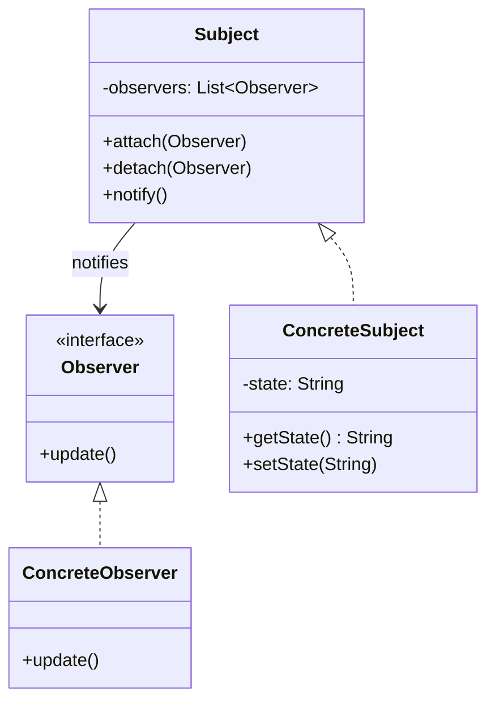
```mermaid
classDiagram
    class Subject {
        -observers: List~Observer~
        +attach(Observer)
        +detach(Observer)
        +notify()
    }
    class Observer {
        <<interface>>
        +update()
    }
    class ConcreteSubject {
        -state: String
        +getState() String
        +setState(String)
    }
    class ConcreteObserver {
        +update()
    }
    
    Subject <|.. ConcreteSubject
    Observer <|.. ConcreteObserver
    Subject --> Observer : notifies
```

```java
// 观察者接口
@FunctionalInterface
public interface Observer {
    void update(String message);
}

// 主题接口
public interface Subject {
    void registerObserver(Observer observer);
    void removeObserver(Observer observer);
    void notifyObservers();
}

// 具体主题
public class NewsAgency implements Subject {
    private final List<Observer> observers = new ArrayList<>();
    private String news;
    
    @Override
    public void registerObserver(Observer observer) {
        observers.add(observer);
    }
    
    @Override
    public void removeObserver(Observer observer) {
        observers.remove(observer);
    }
    
    @Override
    public void notifyObservers() {
        observers.forEach(observer -> observer.update(news));
    }
    
    public void setNews(String news) {
        this.news = news;
        notifyObservers();
    }
}

// 使用示例
NewsAgency agency = new NewsAgency();
agency.registerObserver(message -> System.out.println("TV: " + message));
agency.registerObserver(message -> System.out.println("Radio: " + message));
agency.setNews("Breaking news!");
```

### 10. 策略模式 (Strategy Pattern)

**原理**: 定义算法族，封装每个算法，使它们可以互相替换。

**使用场景**: 支付方式、排序算法、压缩算法、验证规则。

**类图**:
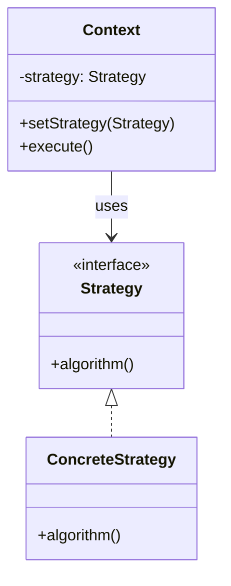
```mermaid
classDiagram
    class Strategy {
        <<interface>>
        +algorithm()
    }
    class ConcreteStrategy {
        +algorithm()
    }
    class Context {
        -strategy: Strategy
        +setStrategy(Strategy)
        +execute()
    }
    
    Strategy <|.. ConcreteStrategy
    Context --> Strategy : uses
```

```java
// 策略接口
@FunctionalInterface
public interface PaymentStrategy {
    void pay(double amount);
}

// 具体策略
public class CreditCardStrategy implements PaymentStrategy {
    @Override
    public void pay(double amount) {
        System.out.println("Paid $" + amount + " using Credit Card");
    }
}

public class PayPalStrategy implements PaymentStrategy {
    @Override
    public void pay(double amount) {
        System.out.println("Paid $" + amount + " using PayPal");
    }
}

// 上下文类
public class PaymentContext {
    private PaymentStrategy strategy;
    
    public void setStrategy(PaymentStrategy strategy) {
        this.strategy = strategy;
    }
    
    public void executePayment(double amount) {
        strategy.pay(amount);
    }
}

// 使用示例
PaymentContext context = new PaymentContext();
context.setStrategy(new CreditCardStrategy());
context.executePayment(100.0);
```

### 11. 命令模式 (Command Pattern)

**原理**: 将请求封装为对象，使你可以用不同的请求、队列或日志来参数化其他对象。

**使用场景**: 撤销操作、宏命令、队列处理、日志记录。

**类图**:
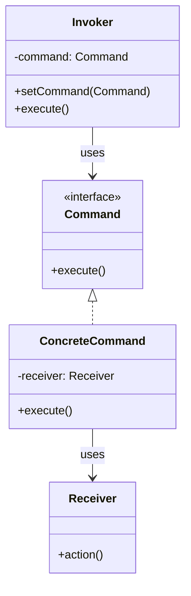
```mermaid
classDiagram
    class Command {
        <<interface>>
        +execute()
    }
    class ConcreteCommand {
        -receiver: Receiver
        +execute()
    }
    class Receiver {
        +action()
    }
    class Invoker {
        -command: Command
        +setCommand(Command)
        +execute()
    }
    
    Command <|.. ConcreteCommand
    ConcreteCommand --> Receiver : uses
    Invoker --> Command : uses
```

```java
// 命令接口
@FunctionalInterface
public interface Command {
    void execute();
}

// 具体命令
public class LightOnCommand implements Command {
    private final Light light;
    
    public LightOnCommand(Light light) {
        this.light = light;
    }
    
    @Override
    public void execute() {
        light.turnOn();
    }
}

// 调用者
public class RemoteControl {
    private final Map<String, Command> commands = new HashMap<>();
    
    public void setCommand(String slot, Command command) {
        commands.put(slot, command);
    }
    
    public void pressButton(String slot) {
        Command command = commands.get(slot);
        if (command != null) {
            command.execute();
        }
    }
}

// 使用示例
Light light = new Light();
RemoteControl remote = new RemoteControl();
remote.setCommand("light", new LightOnCommand(light));
remote.pressButton("light");
```

### 12. 状态模式 (State Pattern)

**原理**: 允许对象在内部状态改变时改变行为，对象看起来像改变了类。

**使用场景**: 状态机、游戏角色状态、订单状态、工作流。

**类图**:
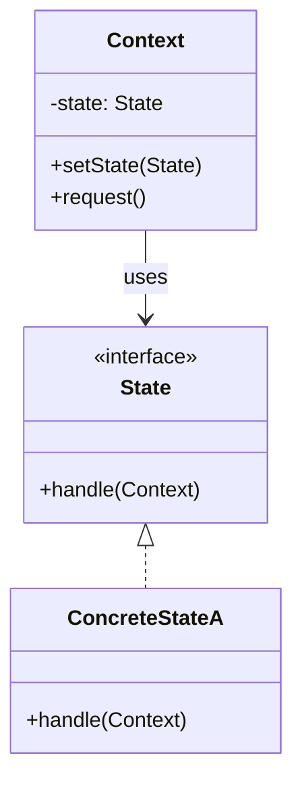
```mermaid
classDiagram
    class State {
        <<interface>>
        +handle(Context)
    }
    class ConcreteStateA {
        +handle(Context)
    }
    class Context {
        -state: State
        +setState(State)
        +request()
    }
    
    State <|.. ConcreteStateA
    Context --> State : uses
```

```java
// 状态接口
public interface State {
    void handle(Context context);
}

// 具体状态
public class ConcreteStateA implements State {
    @Override
    public void handle(Context context) {
        System.out.println("Handling in State A");
        context.setState(new ConcreteStateB());
    }
}

public class ConcreteStateB implements State {
    @Override
    public void handle(Context context) {
        System.out.println("Handling in State B");
        context.setState(new ConcreteStateA());
    }
}

// 上下文类
public class Context {
    private State state;
    
    public Context(State state) {
        this.state = state;
    }
    
    public void setState(State state) {
        this.state = state;
    }
    
    public void request() {
        state.handle(this);
    }
}
```

### 13. 模板方法模式 (Template Method Pattern)

**原理**: 定义算法骨架，将某些步骤延迟到子类中实现。

**使用场景**: 框架设计、数据处理流程、算法模板。

**类图**:
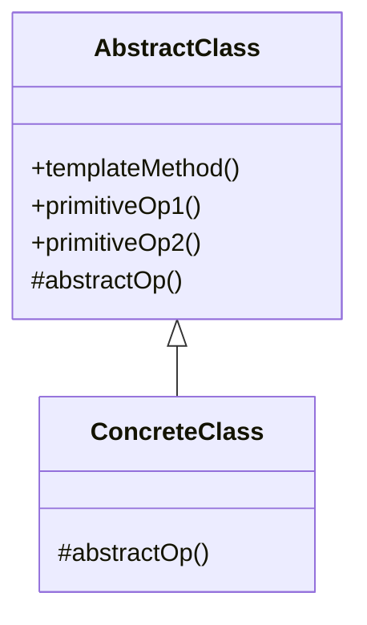
```mermaid
classDiagram
    class AbstractClass {
        +templateMethod()
        +primitiveOp1()
        +primitiveOp2()
        #abstractOp()
    }
    class ConcreteClass {
        #abstractOp()
    }
    
    AbstractClass <|-- ConcreteClass
```

```java
// 抽象模板类
public abstract class DataProcessor {
    // 模板方法
    public final void processData() {
        readData();
        processDataInternal();
        saveData();
    }
    
    protected void readData() {
        System.out.println("Reading data...");
    }
    
    protected abstract void processDataInternal();
    
    protected void saveData() {
        System.out.println("Saving data...");
    }
}

// 具体实现
public class XMLDataProcessor extends DataProcessor {
    @Override
    protected void processDataInternal() {
        System.out.println("Processing XML data...");
    }
}

public class JSONDataProcessor extends DataProcessor {
    @Override
    protected void processDataInternal() {
        System.out.println("Processing JSON data...");
    }
}
```

### 14. 责任链模式 (Chain of Responsibility Pattern)

**原理**: 将请求的发送者和接收者解耦，使多个对象都有机会处理请求。

**使用场景**: 异常处理、权限验证、日志记录、审批流程。

**类图**:
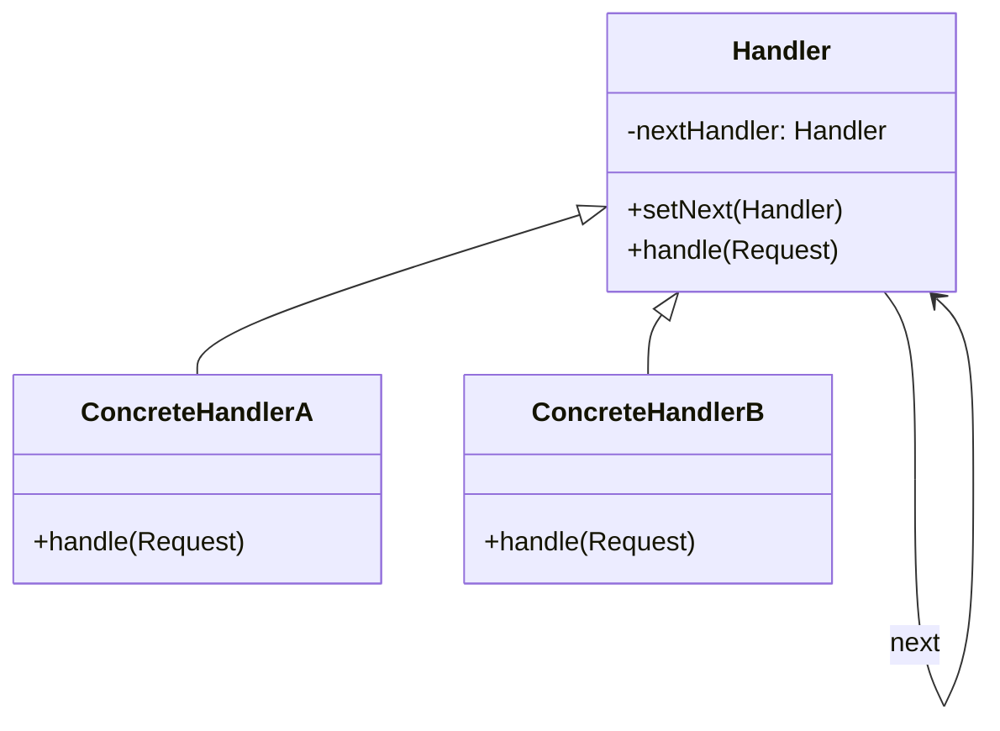
```mermaid
classDiagram
    class Handler {
        -nextHandler: Handler
        +setNext(Handler)
        +handle(Request)
    }
    class ConcreteHandlerA {
        +handle(Request)
    }
    class ConcreteHandlerB {
        +handle(Request)
    }
    
    Handler <|-- ConcreteHandlerA
    Handler <|-- ConcreteHandlerB
    Handler --> Handler : next
```

```java
// 处理器接口
public abstract class Handler {
    protected Handler nextHandler;
    
    public void setNext(Handler nextHandler) {
        this.nextHandler = nextHandler;
    }
    
    public abstract void handleRequest(Request request);
}

// 具体处理器
public class ConcreteHandlerA extends Handler {
    @Override
    public void handleRequest(Request request) {
        if (request.getType().equals("TypeA")) {
            System.out.println("Handler A handles the request");
        } else if (nextHandler != null) {
            nextHandler.handleRequest(request);
        }
    }
}

public class ConcreteHandlerB extends Handler {
    @Override
    public void handleRequest(Request request) {
        if (request.getType().equals("TypeB")) {
            System.out.println("Handler B handles the request");
        } else if (nextHandler != null) {
            nextHandler.handleRequest(request);
        }
    }
}

// 使用示例
Handler handlerA = new ConcreteHandlerA();
Handler handlerB = new ConcreteHandlerB();
handlerA.setNext(handlerB);

Request request = new Request("TypeA");
handlerA.handleRequest(request);
```

### 15. 中介者模式 (Mediator Pattern)

**原理**: 用一个中介对象来封装一系列的对象交互，使各对象不需要显式地相互引用。

**使用场景**: 聊天室、GUI组件交互、飞机调度系统。

**类图**:
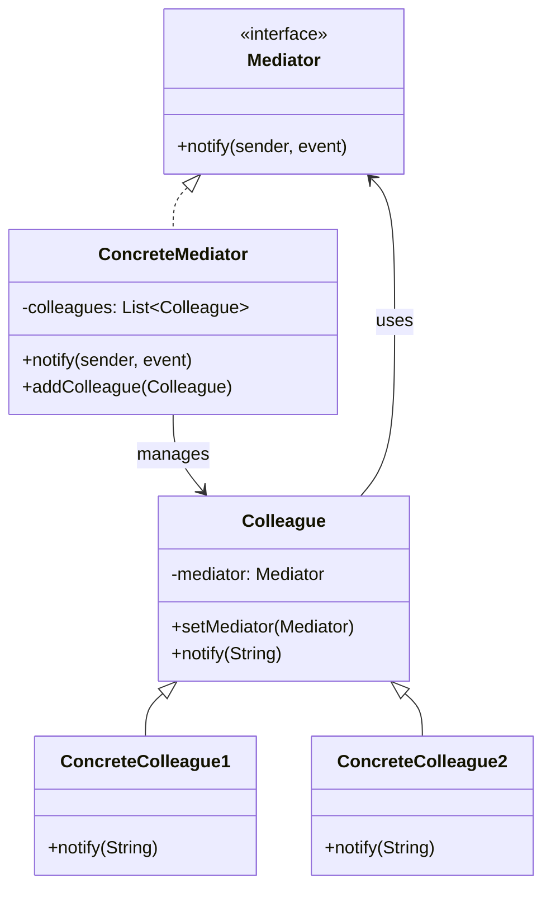
```mermaid
classDiagram
    class Mediator {
        <<interface>>
        +notify(sender, event)
    }
    class ConcreteMediator {
        -colleagues: List~Colleague~
        +notify(sender, event)
        +addColleague(Colleague)
    }
    class Colleague {
        -mediator: Mediator
        +setMediator(Mediator)
        +notify(String)
    }
    class ConcreteColleague1 {
        +notify(String)
    }
    class ConcreteColleague2 {
        +notify(String)
    }
    
    Mediator <|.. ConcreteMediator
    Colleague <|-- ConcreteColleague1
    Colleague <|-- ConcreteColleague2
    ConcreteMediator --> Colleague : manages
    Colleague --> Mediator : uses
```

```java
// 中介者接口
public interface ChatMediator {
    void sendMessage(String message, User user);
    void addUser(User user);
}

// 具体中介者
public class ChatRoom implements ChatMediator {
    private final List<User> users = new ArrayList<>();
    
    @Override
    public void addUser(User user) {
        users.add(user);
    }
    
    @Override
    public void sendMessage(String message, User user) {
        users.stream()
            .filter(u -> !u.equals(user))
            .forEach(u -> u.receive(message));
    }
}

// 同事类
public abstract class User {
    protected ChatMediator mediator;
    protected String name;
    
    public User(ChatMediator mediator, String name) {
        this.mediator = mediator;
        this.name = name;
    }
    
    public abstract void send(String message);
    public abstract void receive(String message);
}

// 具体同事类
public class ChatUser extends User {
    public ChatUser(ChatMediator mediator, String name) {
        super(mediator, name);
    }
    
    @Override
    public void send(String message) {
        System.out.println(name + " sends: " + message);
        mediator.sendMessage(message, this);
    }
    
    @Override
    public void receive(String message) {
        System.out.println(name + " receives: " + message);
    }
}

// 使用示例
ChatMediator chatRoom = new ChatRoom();
User user1 = new ChatUser(chatRoom, "Alice");
User user2 = new ChatUser(chatRoom, "Bob");
User user3 = new ChatUser(chatRoom, "Charlie");

chatRoom.addUser(user1);
chatRoom.addUser(user2);
chatRoom.addUser(user3);

user1.send("Hello everyone!");
user2.send("Hi Alice!");
```

### 16. 备忘录模式 (Memento Pattern)

**原理**: 在不破坏封装性的前提下，捕获一个对象的内部状态，并在该对象之外保存这个状态。

**使用场景**: 撤销操作、游戏存档、数据库事务回滚。

**类图**:
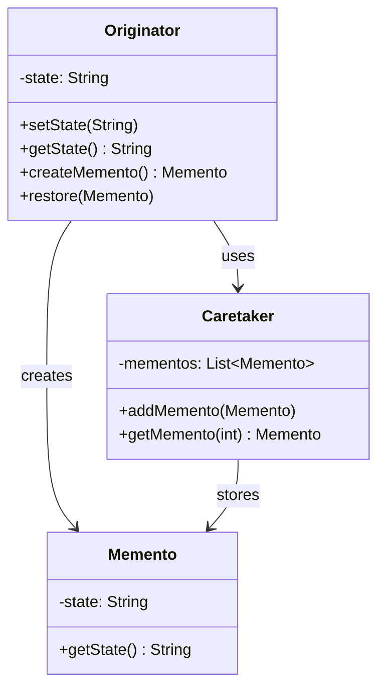
```mermaid
classDiagram
    class Originator {
        -state: String
        +setState(String)
        +getState() String
        +createMemento() Memento
        +restore(Memento)
    }
    class Memento {
        -state: String
        +getState() String
    }
    class Caretaker {
        -mementos: List~Memento~
        +addMemento(Memento)
        +getMemento(int) Memento
    }
    
    Originator --> Memento : creates
    Caretaker --> Memento : stores
    Originator --> Caretaker : uses
```

```java
// 备忘录类
public class Memento {
    private final String state;
    
    public Memento(String state) {
        this.state = state;
    }
    
    public String getState() {
        return state;
    }
}

// 原发器
public class TextEditor {
    private String content;
    
    public void setContent(String content) {
        this.content = content;
    }
    
    public String getContent() {
        return content;
    }
    
    public Memento save() {
        return new Memento(content);
    }
    
    public void restore(Memento memento) {
        this.content = memento.getState();
    }
}

// 管理者
public class History {
    private final List<Memento> mementos = new ArrayList<>();
    
    public void addMemento(Memento memento) {
        mementos.add(memento);
    }
    
    public Memento getMemento(int index) {
        return mementos.get(index);
    }
    
    public int size() {
        return mementos.size();
    }
}

// 使用示例
TextEditor editor = new TextEditor();
History history = new History();

editor.setContent("Hello World");
history.addMemento(editor.save());

editor.setContent("Hello Java");
history.addMemento(editor.save());

editor.setContent("Hello Design Patterns");
history.addMemento(editor.save());

// 撤销到第一个版本
editor.restore(history.getMemento(0));
System.out.println("Restored content: " + editor.getContent());
```

### 17. 访问者模式 (Visitor Pattern)

**原理**: 表示一个作用于某对象结构中的各元素的操作，它使你可以在不改变各元素的类的前提下定义作用于这些元素的新操作。

**使用场景**: 编译器AST、文档处理、报表生成。

**类图**:
```mermaid
classDiagram
    class Visitor {
        <<interface>>
        +visitElementA(ElementA)
        +visitElementB(ElementB)
    }
    class ConcreteVisitor1 {
        +visitElementA(ElementA)
        +visitElementB(ElementB)
    }
    class Element {
        <<interface>>
        +accept(Visitor)
    }
    class ElementA {
        +accept(Visitor)
        +operationA()
    }
    class ElementB {
        +accept(Visitor)
        +operationB()
    }
    class ObjectStructure {
        -elements: List~Element~
        +accept(Visitor)
        +add(Element)
    }
    
    Visitor <|.. ConcreteVisitor1
    Element <|.. ElementA
    Element <|.. ElementB
    ObjectStructure --> Element : contains
    Element --> Visitor : accepts
```

```java
// 访问者接口
public interface Visitor {
    void visit(Book book);
    void visit(Fruit fruit);
}

// 具体访问者
public class ShoppingCartVisitor implements Visitor {
    private int totalCost = 0;
    
    @Override
    public void visit(Book book) {
        totalCost += book.getPrice();
        System.out.println("Book: " + book.getName() + " - $" + book.getPrice());
    }
    
    @Override
    public void visit(Fruit fruit) {
        totalCost += fruit.getPrice() * fruit.getWeight();
        System.out.println("Fruit: " + fruit.getName() + " - $" + (fruit.getPrice() * fruit.getWeight()));
    }
    
    public int getTotalCost() {
        return totalCost;
    }
}

// 元素接口
public interface ItemElement {
    int accept(Visitor visitor);
}

// 具体元素
public class Book implements ItemElement {
    private final String name;
    private final int price;
    
    public Book(String name, int price) {
        this.name = name;
        this.price = price;
    }
    
    public String getName() { return name; }
    public int getPrice() { return price; }
    
    @Override
    public int accept(Visitor visitor) {
        visitor.visit(this);
        return price;
    }
}

public class Fruit implements ItemElement {
    private final String name;
    private final int pricePerKg;
    private final int weight;
    
    public Fruit(String name, int pricePerKg, int weight) {
        this.name = name;
        this.pricePerKg = pricePerKg;
        this.weight = weight;
    }
    
    public String getName() { return name; }
    public int getPrice() { return pricePerKg; }
    public int getWeight() { return weight; }
    
    @Override
    public int accept(Visitor visitor) {
        visitor.visit(this);
        return pricePerKg * weight;
    }
}

// 使用示例
List<ItemElement> items = Arrays.asList(
    new Book("Design Patterns", 20),
    new Fruit("Apple", 3, 2),
    new Book("Java Guide", 15),
    new Fruit("Banana", 2, 3)
);

ShoppingCartVisitor visitor = new ShoppingCartVisitor();
items.forEach(item -> item.accept(visitor));
System.out.println("Total cost: $" + visitor.getTotalCost());
```

### 18. 解释器模式 (Interpreter Pattern)

**原理**: 给定一个语言，定义它的文法的一种表示，并定义一个解释器，这个解释器使用该表示来解释语言中的句子。

**使用场景**: 正则表达式、SQL解析、数学表达式计算。

**类图**:
```mermaid
classDiagram
    class Expression {
        <<interface>>
        +interpret(context) int
    }
    class TerminalExpression {
        -data: String
        +interpret(context) int
    }
    class NonTerminalExpression {
        -expression1: Expression
        -expression2: Expression
        +interpret(context) int
    }
    class Context {
        -input: String
        -output: int
        +getInput() String
        +setOutput(int)
    }
    
    Expression <|.. TerminalExpression
    Expression <|.. NonTerminalExpression
    NonTerminalExpression --> Expression : contains
    Expression --> Context : uses
```

```java
// 表达式接口
public interface Expression {
    int interpret();
}

// 终结符表达式
public class NumberExpression implements Expression {
    private final int number;
    
    public NumberExpression(int number) {
        this.number = number;
    }
    
    @Override
    public int interpret() {
        return number;
    }
}

// 非终结符表达式
public class AddExpression implements Expression {
    private final Expression left;
    private final Expression right;
    
    public AddExpression(Expression left, Expression right) {
        this.left = left;
        this.right = right;
    }
    
    @Override
    public int interpret() {
        return left.interpret() + right.interpret();
    }
}

public class SubtractExpression implements Expression {
    private final Expression left;
    private final Expression right;
    
    public SubtractExpression(Expression left, Expression right) {
        this.left = left;
        this.right = right;
    }
    
    @Override
    public int interpret() {
        return left.interpret() - right.interpret();
    }
}

// 解释器
public class Calculator {
    public int calculate(String expression) {
        // 简单的表达式解析器 (仅支持加减法)
        String[] tokens = expression.split(" ");
        Expression result = new NumberExpression(Integer.parseInt(tokens[0]));
        
        for (int i = 1; i < tokens.length; i += 2) {
            String operator = tokens[i];
            int number = Integer.parseInt(tokens[i + 1]);
            
            if ("+".equals(operator)) {
                result = new AddExpression(result, new NumberExpression(number));
            } else if ("-".equals(operator)) {
                result = new SubtractExpression(result, new NumberExpression(number));
            }
        }
        
        return result.interpret();
    }
}

// 使用示例
Calculator calculator = new Calculator();
int result1 = calculator.calculate("10 + 5 - 3");
int result2 = calculator.calculate("20 - 10 + 5");

System.out.println("10 + 5 - 3 = " + result1);
System.out.println("20 - 10 + 5 = " + result2);
```

### 19. 迭代器模式 (Iterator Pattern)

**原理**: 提供一种方法顺序访问聚合对象中各个元素，而不暴露内部表示。

**使用场景**: 集合遍历、数据库结果集、文件系统遍历。

**类图**:
```mermaid
classDiagram
    class Iterator {
        <<interface>>
        +hasNext() boolean
        +next() Object
    }
    class Aggregate {
        <<interface>>
        +createIterator() Iterator
    }
    class ConcreteIterator {
        +hasNext() boolean
        +next() Object
    }
    class ConcreteAggregate {
        +createIterator() Iterator
    }
    
    Iterator <|.. ConcreteIterator
    Aggregate <|.. ConcreteAggregate
    ConcreteAggregate --> ConcreteIterator : creates
```

```java
// 迭代器接口
public interface Iterator<T> {
    boolean hasNext();
    T next();
}

// 聚合接口
public interface Container<T> {
    Iterator<T> getIterator();
}

// 具体聚合类
public class NameRepository implements Container<String> {
    private final String[] names = {"Robert", "John", "Julie", "Lora"};
    
    @Override
    public Iterator<String> getIterator() {
        return new NameIterator();
    }
    
    private class NameIterator implements Iterator<String> {
        int index;
        
        @Override
        public boolean hasNext() {
            return index < names.length;
        }
        
        @Override
        public String next() {
            if (hasNext()) {
                return names[index++];
            }
            return null;
        }
    }
}

// 使用示例
Container<String> nameRepository = new NameRepository();
Iterator<String> iterator = nameRepository.getIterator();
while (iterator.hasNext()) {
    System.out.println(iterator.next());
}
```

## 总结

设计模式是面向对象设计的重要概念，GoF经典23种设计模式每种都有其特定的使用场景和优势：

### 📊 **模式分类统计**

**创建型模式 (5种)**
- 单例模式 - 全局唯一实例
- 工厂方法模式 - 对象创建封装
- 抽象工厂模式 - 产品族创建
- 建造者模式 - 复杂对象构建
- 原型模式 - 对象克隆复制

**结构型模式 (7种)**
- 适配器模式 - 接口转换
- 桥接模式 - 抽象与实现分离
- 组合模式 - 树形结构处理
- 装饰器模式 - 动态功能增强
- 外观模式 - 复杂系统统一接口
- 享元模式 - 对象共享优化
- 代理模式 - 访问控制

**行为型模式 (11种)**
- 观察者模式 - 事件通知机制
- 策略模式 - 算法族封装
- 命令模式 - 请求封装
- 状态模式 - 状态驱动行为
- 模板方法模式 - 算法骨架定义
- 责任链模式 - 请求处理链
- 中介者模式 - 对象交互解耦
- 备忘录模式 - 状态保存恢复
- 访问者模式 - 操作与结构分离
- 解释器模式 - 语言解释执行
- 迭代器模式 - 集合遍历

### 🎯 **选择指南**

- **创建型模式**: 当需要灵活控制对象创建时使用
- **结构型模式**: 当需要处理类或对象组合时使用  
- **行为型模式**: 当需要处理对象间通信和职责分配时使用

### ⚡ **Java 8优化**

现代Java开发中，许多模式可以通过函数式编程特性简化：
- **策略模式** → Lambda表达式
- **观察者模式** → 函数式接口
- **命令模式** → 方法引用
- **模板方法模式** → 默认方法

### 💡 **最佳实践**

1. **理解原理** - 掌握模式背后的设计思想
2. **适度使用** - 避免过度设计，根据实际需求选择
3. **组合使用** - 多个模式可以组合解决复杂问题
4. **持续重构** - 随着需求变化调整设计

记住：**模式是工具，不是目标**。理解模式背后的设计思想比记住具体的实现更重要。
